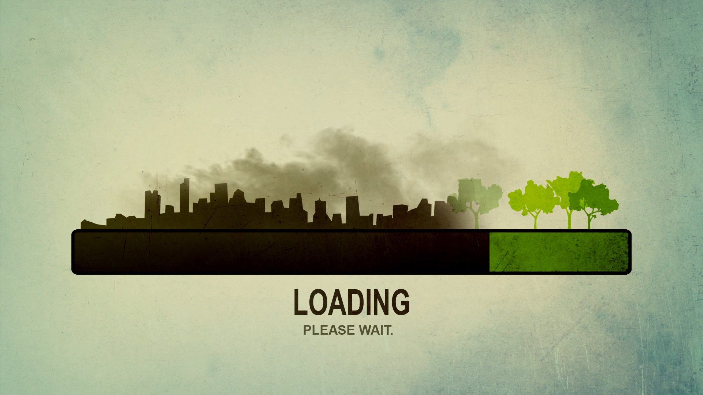
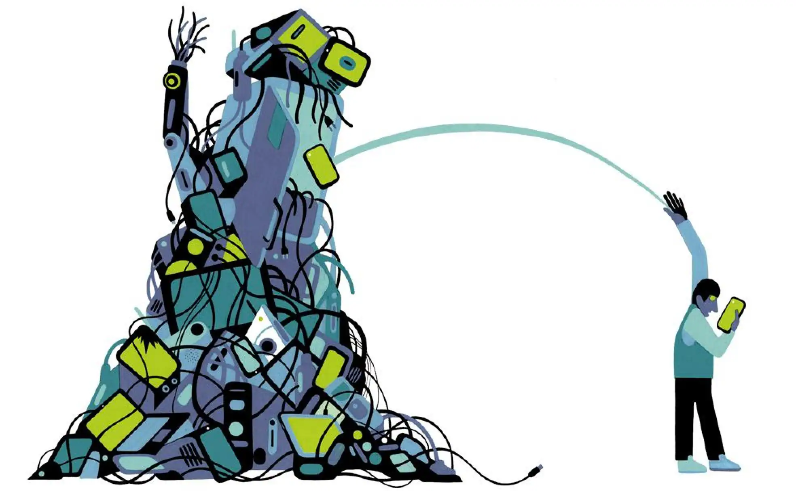

# Informatica Ambiental

## Indice 
  1. ¿Qué es la contaminación ambiental?
  2. Residuos
  3. Obsolescencia informática
  4. Computación verde

## Referencias
<!-- enlaces -->
[¿Que es la contaminación medioambiental?](https://www.fundacionaquae.org/wiki/causas-contaminacion-ambiental/)

Llevamos escuchando la palabra **cambio climático** continuamente desde hace años cada dia, somos bombardeados con noticias de esta emergencia climática sin parar por cualquier medio de comunicacion. Y lo cierto es que es una realidad tan cruel que hay gente que quiere negarlo para no tener una preocupación más en su dia a dia, pero la realidad no tiene piedad, se incrementan las sequias, los mega incendios, las inundaciones y se pierde la biodiversidad. Todo esto se ha aumentado exponencialmente desde la revolución industrial. Aquí hablaremos de las tecnologías TIC y el impacto sobre esta catástrofe inminente, pero no solo te daremos el dato, sino, que también, una posible y esperanzadora solución. A lo mejor tu puedes demostrar que quizas el ser humano aun guarde un mínimo de respeto por su hogar azul.
<!-- linea horizontal -->
---
---

<!-- linea horizontal -->
---
---
<!-- enlaces -->
[Residuos](https://www.nationalgeographic.com.es/mundo-ng/peligros-basura-electronica_13239) 

En las últimas décadas las TIC han evolucionado de forma exponencial, el aumento en la producción de dispositivos electrónicos nos ha facilitado la vida y ha permitido al mundo crear nuevas maneras de comunicarse. Pero cualquier historia dejaría de ser bonita si no tuviera una parte tenebrosa. Vamos a hablar de los **residuos informáticos**, un factor que tiene un importante impacto en el medioambiente pero que poco se habla debido a la voz cantante del plástico y los combustibles fósiles. Estos residuos aumentan masivamente debido a la evolución de las TIC y poseen materiales altamente contaminantes como el **mercurio, plomo, cadmio, cromo, arsénico o antimonio**, algunos de ellos como el **mercurio** produce daños en el cerebro y el sistema nervioso, y algunos aparatos como una batería de níquel-cadmio (empleada en teléfonos móviles) contamina 50.000 litros de agua.

<!-- linea horizontal -->
---
---

<!-- linea horizontal -->
---
---

<!-- enlaces -->
[Obsolescencia Programada](https://www.iberdrola.com/sostenibilidad/obsolescencia-programada)

La absolencia programada es un modelo que se aplica desde decadas pasadas a una multitud de productos de cosumo. Esto consiste en que un producto deje de funcionar a corto-medio plazo para asi poder vender más.
Esto se aplicaba en automoviles pero con la llegada de las nuevas tecnologias se le aplica a la electronica, (ya sea ordenadores,televisores, lavadoras, lavavajillas, microondas, etc)

<!-- linea horizontal -->
---
---

<!-- linea horizontal -->
---
---

<!-- enlaces -->
[Computación verde](https://geekflare.com/es/green-computing-for-sustainable-future/)

La **computación verde** se basa en una manera sostenible y ecologica de utilizar las tecnologias elctronicas para poder solucionar el problema de la contaminacion por las TIC. Una **solucion** a este problema puede ser la computacion verde, un modelo ecológico y con una semejanza a la **economía circular** aplicada a las nuevas tecnologias. Este modelo es la antítesis de la producción masiva actual y de como vimos en el punto anterio de la **obsolescencia programada**. Sus principales onjetivos son la eficencia energética, uso de software y hardware ecológicos, la reducción de sustancias peligrosas, el reciclaje de materiales y aumentar la vida útil de los productos. Una estrategia que podria ser efectiva para reducir la huella de carbono de las TIC. Si consigue aplicarse bien estas estrategias podria ser rentable tanto para empresas como para consumidores, ya que se ahorrarian parte de las inversiones en materiales en reciclaje y para los consumidores el ahorrarnos volver a comprar el mismo producto cada año, ya que en el mercado abusivo y adictivo de las nuevas tecnologias, la mayoria siempre perdemos creyendo que estamos al dia por tener el mismo producto pero con un número más.
<!-- linea horizontal -->
---
---

<!-- linea horizontal -->
---
---

## Autores 

## Licencia

  
This work is licensed under <a href="http://creativecommons.org/licenses/by-nc/4.0/?ref=chooser-v1" target="_blank" rel="license noopener noreferrer" style="display:inline-block;">CC BY-NC 4.0</a>
 
